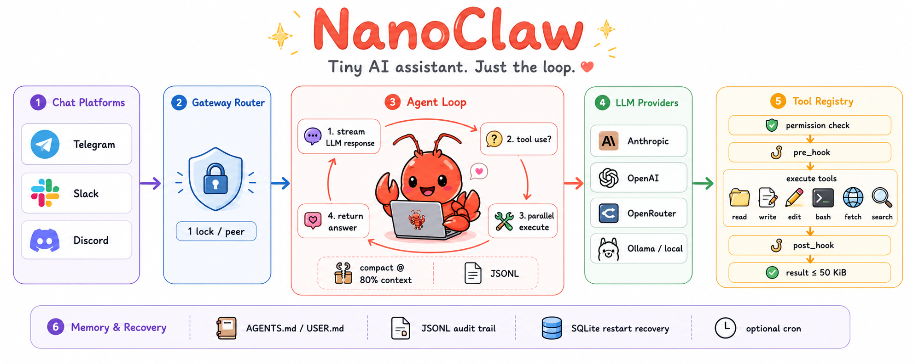
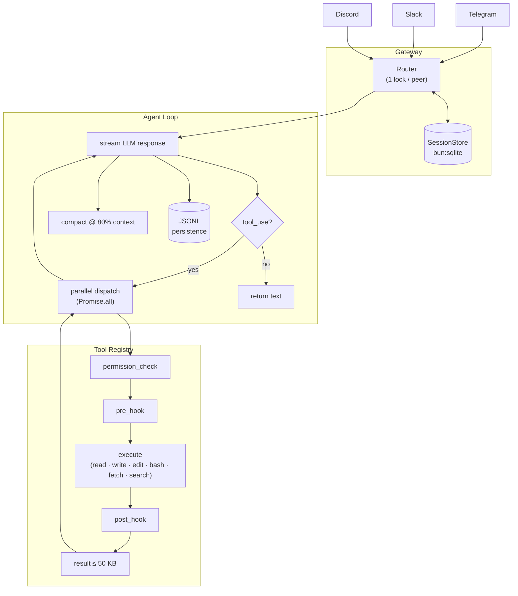

# 🦞 NanoClaw

> Your personal AI assistant - like Hermes or OpenClaw, but distilled to its essentials.  
> **~2,000 lines of TypeScript. No dashboard. No bloat. Just the loop.**

<p>
  <a href="https://bun.sh"></a>
  <a href="LICENSE"></a>
  <a href="#architecture"></a>
</p>

```
User: "summarize the errors in app.log from the last 10 minutes"
Bot:  [reads file] [runs grep] → "Found 3 ERROR lines: connection timeout (×2), OOM at 14:32"
```



---

## Why NanoClaw?

Most agent runtimes ship hundreds of abstractions, dozens of providers, and dashboards you never open. NanoClaw is a **design**: the fewest moving parts that still make a capable, recoverable personal assistant.

| | NanoClaw | OpenClaw | Hermes Agent |
|---|---|---|---|
| Lines of code | ~2,000 | ~500,000–800,000 | ~10,000–15,000 |
| Runtime | Bun + TypeScript | TS · Swift · Kotlin · more | Python |
| Chat platforms | 3 (TG · Slack · Discord) | 20+ (WhatsApp · Signal · iMessage · WeChat · IRC · …) | 6 (TG · Discord · Slack · WhatsApp · Signal · CLI) |
| Install | `bun install` | `npm install -g openclaw` + onboard wizard | `curl … \| bash` installer |
| Config | Single `.env` file | JSON5 config + `openclaw onboard` wizard | `hermes setup` wizard + `hermes config set` |
| Per-peer concurrency | ✅ single-slot pending buffer (newest wins) | ✅ | ✅ |
| Voice | ❌ | ✅ wake word + talk mode (macOS · iOS · Android) | ❌ (memo transcription only) |
| Subagents | ❌ | ✅ multi-agent routing | ✅ spawn isolated subagents |
| Self-improvement | ❌ | ❌ | ✅ (DSPy + GEPA) |
| Skills marketplace | ❌ | ✅ ClawHub | ✅ agentskills.io |
| Companion apps | ❌ | ✅ macOS menu bar · iOS · Android | ❌ |
| Deployment | Local process | Daemon (launchd/systemd) · Docker | Local · Docker · SSH · Modal (serverless) |
| Hack-friendly | ✅ read in an afternoon | Needs weeks to orient | Moderate (~10k LOC) |

---

## Features

<table align="center" width="100%">
<tr>
<td width="20%" align="center" style="vertical-align: top; padding: 12px;">

### 🔄 Agent Loop

<div align="center">
  
</div>

<small>• Streaming tool-call loop</small><br/>
<small>• Parallel tool dispatch</small><br/>
<small>• Retry backoff + token guard</small>

</td>
<td width="20%" align="center" style="vertical-align: top; padding: 12px;">

### 🛠 Kernel Tools

<div align="center">
  
</div>

<small>• File read / write / edit</small><br/>
<small>• Shell execution</small><br/>
<small>• Web fetch + web search</small>

</td>
<td width="20%" align="center" style="vertical-align: top; padding: 12px;">

### 🔌 Provider Abstraction

<div align="center">
  
</div>

<small>• Anthropic + OpenAI</small><br/>
<small>• OpenAI-compatible endpoints</small><br/>
<small>• OpenRouter + local Ollama</small>

</td>
<td width="20%" align="center" style="vertical-align: top; padding: 12px;">

### 🔐 Safety & Permissions

<div align="center">
  
</div>

<small>• Prompt / auto / read-only modes</small><br/>
<small>• Denied-command prefix matching</small><br/>
<small>• Blocks credential path reads</small>

</td>
<td width="20%" align="center" style="vertical-align: top; padding: 12px;">

### ♻️ State &amp; Recovery

<div align="center">
  
</div>

<small>• Isolated OS process per run</small><br/>
<small>• External coordination state</small><br/>
<small>• JSONL + SQLite restart recovery</small>

</td>
</tr>
</table>

---

## Getting Your API Tokens

You need two tokens: one for the LLM, one for the chat platform.

**LLM (pick one)**

| Provider | Where to get it | Env var |
|---|---|---|
| OpenRouter (recommended) | [openrouter.ai/keys](https://openrouter.ai/keys) - free tier available, access to all models | `OPENROUTER_API_KEY` |
| Anthropic | [console.anthropic.com/keys](https://console.anthropic.com/keys) | `ANTHROPIC_API_KEY` |
| OpenAI | [platform.openai.com/api-keys](https://platform.openai.com/api-keys) | `OPENAI_API_KEY` |

**Chat platform (pick one)**

| Platform | Steps |
|---|---|
| Discord | [discord.com/developers/applications](https://discord.com/developers/applications) - New Application - Bot - Reset Token. Enable `Message Content Intent`. Invite bot with `bot` + `applications.commands` scopes. |
| Telegram | Message [@BotFather](https://t.me/BotFather) on Telegram - `/newbot` - copy the token. |
| Slack | [api.slack.com/apps](https://api.slack.com/apps) - Create App - Socket Mode on - add `chat:write` + `im:history` scopes - install to workspace. You need both `SLACK_BOT_TOKEN` (`xoxb-`) and `SLACK_APP_TOKEN` (`xapp-`). |

---

## Quick Start

```bash
git clone https://github.com/Engineering4AI/nanoclaw
cd nanoclaw
bun install                    # core deps
bun install grammy             # + Telegram adapter
# bun install @slack/bolt      # + Slack adapter
# bun install discord.js       # + Discord adapter

cp .env.example .env
# edit .env — set your API key + bot token

bun src/main.ts
```

That's it. First run bootstraps `~/.nanoclaw/config.yaml` and workspace files automatically.

---

## Configuration

Everything lives in `.env` — no code changes needed:

```bash
# LLM (default: OpenRouter)
OPENROUTER_API_KEY=sk-or-...
NANOCLAW_MODEL=anthropic/claude-sonnet-4-6
NANOCLAW_PROVIDER=openai_compatible
NANOCLAW_BASE_URL=https://openrouter.ai/api/v1

# Platform (pick one)
DISCORD_TOKEN=your-discord-bot-token
# TELEGRAM_TOKEN=your-telegram-bot-token
# SLACK_BOT_TOKEN=xoxb-...
# SLACK_APP_TOKEN=xapp-...

# Agent behavior
NANOCLAW_PERMISSION_MODE=default   # default | auto | plan

# Cron jobs (optional) — semicolon-separated: SCHEDULE|PROMPT[|label]
# NANOCLAW_CRON=30m|check disk usage and warn if above 90%|disk;1h|summarize today's errors in ~/app.log|logs
```

Switch to Anthropic directly:
```bash
ANTHROPIC_API_KEY=sk-ant-...
NANOCLAW_PROVIDER=anthropic
NANOCLAW_MODEL=claude-opus-4-8
```

---

## Architecture



---

## File Layout

```
src/
  main.ts                      # entry point — reads env, starts gateway
  config.ts                    # Config interface + YAML load
  permissions.ts               # PermissionPolicy, 3 modes, sensitive-path guard
  hooks.ts                     # pre/post hook registry

  providers/
    base.ts                    # Provider ABC, StreamResponse, ToolUse, ToolResult
    anthropic.ts               # AnthropicProvider — backoff on 429/529
    openai.ts                  # OpenAIProvider — converts tool schema to OpenAI format
    index.ts                   # getProvider() factory

  tools/
    index.ts                   # Tool type, executeParallel(), buildRegistry()
    files.ts                   # read_file, write_file, edit_file
    shell.ts                   # run_bash (120s timeout)
    web.ts                     # web_fetch (HTML stripped), web_search (DuckDuckGo)

  agent/
    loop.ts                    # run() — the agent loop
    compactor.ts               # compact when estimated tokens > 80% context window
    session.ts                 # JSONL append-only persistence per session_id

  memory/
    workspace.ts               # bootstrap AGENTS.md/USER.md, build system prompt

  gateway/
    index.ts                   # GatewayConfig, start()
    session.ts                 # SessionStore — bun:sqlite-backed
    router.ts                  # onMessage → lock → agent loop → chunk → deliver
    adapters/
      base.ts                  # ChannelAdapter abstract class
      telegram.ts              # grammy polling
      slack.ts                 # @slack/bolt socket mode
      discord.ts               # discord.js intents

  ui/
    App.tsx                    # React Ink root — gateway log + active sessions view
    SessionPanel.tsx           # Per-session message stream
    StatusBar.tsx              # Model · permission mode · uptime
```

---

## Persistent Memory

NanoClaw ships with two workspace files that persist across sessions:

- **`~/.nanoclaw/workspace/AGENTS.md`** — operating instructions, task notes, agent persona. Injected as system prompt prefix.
- **`~/.nanoclaw/workspace/USER.md`** — user profile, preferences. Injected after AGENTS.md.

Edit these files to shape how the agent behaves. No vector store, no database — just files.

---

## Intentionally Not Included

| Feature | Add it when... |
|---|---|
| Multi-agent board | You have >1 agent profile needing coordination |
| MCP servers | You hit a tool gap the 6 kernel tools can't cover |
| Dashboard / TUI | Gateway is the interface; the Ink UI is optional |
| Skills / macros | `AGENTS.md` handles this at minimal scale |
| Trajectory recording | You need RL training data |

---

## The One Rule

> Each agent run is an OS process. Coordination state lives outside the process.

Session JSONL survives crashes. SQLite session store survives gateway restarts. A restart picks up where it left off. This constraint keeps everything else simple.
