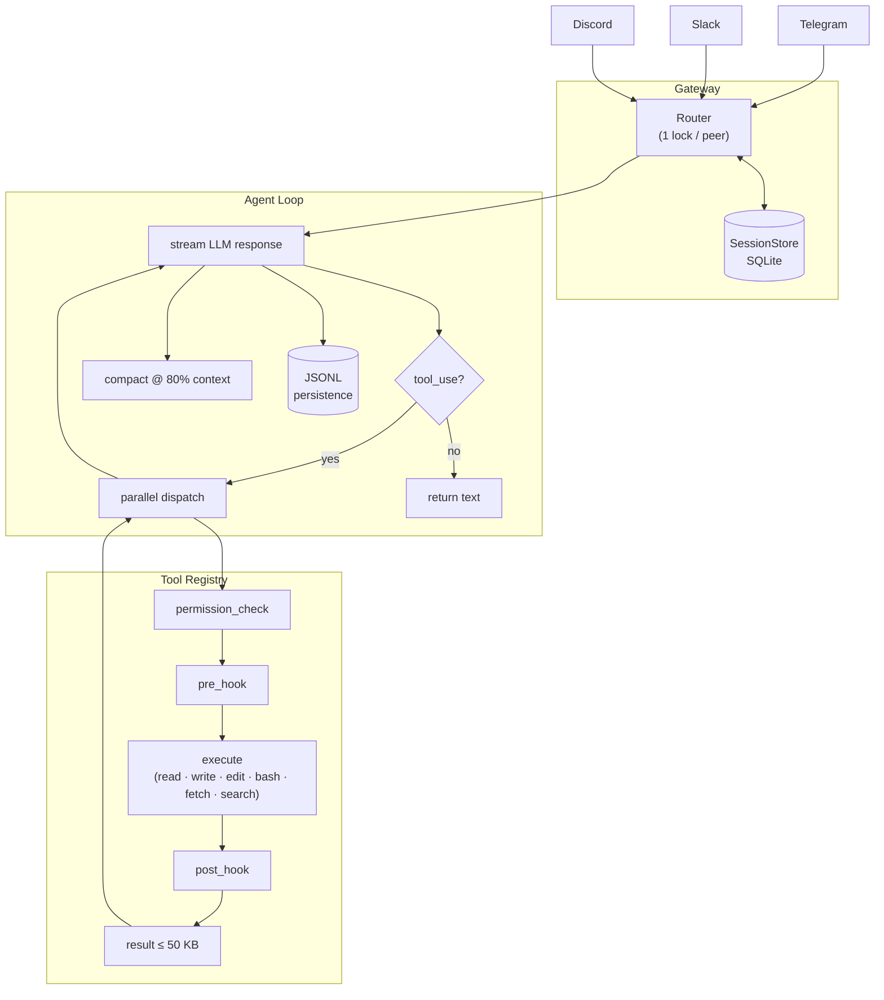

# 🦞 NanoClaw

> Your personal AI assistant - like Hermes or OpenClaw, but distilled to its essentials.  
> **~1,500 lines of Python. No dashboard. No bloat. Just the loop.**

[](https://python.org)
[](LICENSE)
[](#architecture)

```
User: "summarize the errors in app.log from the last 10 minutes"
Bot:  [reads file] [runs grep] → "Found 3 ERROR lines: connection timeout (×2), OOM at 14:32"
```


---

## Why NanoClaw?

Most agent runtimes ship hundreds of abstractions, dozens of providers, and dashboards you never open. NanoClaw is a **design**: the fewest moving parts that still make a capable, recoverable personal assistant.

| | NanoClaw | Claude Code CLI | Full agent framework |
|---|---|---|---|
| Lines of code | ~1,500 | ~50,000 | 10,000–200,000 |
| Chat platforms | Telegram · Slack · Discord | Terminal only | Varies |
| State survives crash | ✅ JSONL + SQLite | ✅ | Depends |
| Needs a database | ❌ SQLite built-in | ❌ | Often yes |
| Cron / dashboard | ❌ (use real cron) | ❌ | Often yes |

---

## Features

<table align="center" width="100%">
<tr>
<td width="25%" align="center" style="vertical-align: top; padding: 15px;">

### 🔄 Agent Loop

<div align="center">
  
</div>

**• Streaming Tool-Call Cycle**  
**• Parallel Tool Dispatch**  
**• Exponential Backoff (429/529)**  
**• Hard Token Limit Guard**

</td>
<td width="25%" align="center" style="vertical-align: top; padding: 15px;">

### 🛠 Kernel Tools

<div align="center">
  
</div>

**• `read_file` · `write_file` · `edit_file`**  
**• `run_bash` (120s, stdout+stderr)**  
**• `web_fetch` (HTML stripped)**  
**• `web_search` (DuckDuckGo)**

</td>
<td width="25%" align="center" style="vertical-align: top; padding: 15px;">

### 🔐 Permissions

<div align="center">
  
</div>

**• `default` - prompt before write/shell**  
**• `auto` - allow all (CI/sandbox)**  
**• `plan` - read-only review mode**  
**• Sensitive path guard (`~/.ssh`, `~/.aws`)**

</td>
<td width="25%" align="center" style="vertical-align: top; padding: 15px;">

### 📦 Context & Memory

<div align="center">
  
</div>

**• Auto-compact at 80% context window**  
**• JSONL session persistence**  
**• `AGENTS.md` / `USER.md` workspace**  
**• Crash recovery - restart mid-session**

</td>
</tr>
<tr>
<td width="25%" align="center" style="vertical-align: top; padding: 15px;">

### 💬 Multi-Platform Gateway

<div align="center">
  
</div>

**• Telegram · Slack · Discord**  
**• 2-method adapter interface**  
**• 1 lock per peer (no pile-up)**  
**• Block streaming for long replies**

</td>
<td width="25%" align="center" style="vertical-align: top; padding: 15px;">

### 🔌 Multi-Provider

<div align="center">
  
</div>

**• Anthropic (Claude)**  
**• OpenAI**  
**• Any OpenAI-compatible endpoint**  
**• OpenRouter, local Ollama, etc.**

</td>
<td width="25%" align="center" style="vertical-align: top; padding: 15px;">

### ♻️ Crash Recovery

<div align="center">
  
</div>

**• Each run is an isolated OS process**  
**• No shared in-process state to corrupt**  
**• Coordination state lives outside the process**  
**• Resume exactly where the crash occurred**

</td>
<td width="25%" align="center" style="vertical-align: top; padding: 15px;">

### 🔒 Secure by Default

<div align="center">
  
</div>

**• No `HTTP_PROXY` inheritance**  
**• Opt-in proxy via `NANOCLAW_WEB_PROXY`**  
**• Credential path guard**  
**• Denied command prefix matching**

</td>
</tr>
</table>

---

## Quick Start

```bash
git clone https://github.com/Engineering4AI/nanoclaw
cd nanoclaw
pip install -e ".[discord]"   # or [telegram] / [slack]

cp .env.example .env
# edit .env - set your API key + bot token

python -m nanoclaw
```

That's it. First run bootstraps `~/.nanoclaw/config.yaml` and workspace files automatically.

---

## Configuration

Everything lives in `.env` - no code changes needed:

```bash
# LLM (default: OpenRouter)
OPENROUTER_API_KEY=sk-or-...
NANOCLAW_MODEL=anthropic/claude-sonnet-4-6
NANOCLAW_PROVIDER=openai_compatible
NANOCLAW_BASE_URL=https://openrouter.ai/api/v1

# Platform (pick one)
DISCORD_TOKEN=your-discord-bot-token
# TELEGRAM_TOKEN=your-telegram-bot-token
# SLACK_BOT_TOKEN=xoxb-...
# SLACK_APP_TOKEN=xapp-...

# Agent behavior
NANOCLAW_PERMISSION_MODE=default   # default | auto | plan
```

Switch to Anthropic directly:
```bash
ANTHROPIC_API_KEY=sk-ant-...
NANOCLAW_PROVIDER=anthropic
NANOCLAW_MODEL=claude-opus-4-8
```

---

## Architecture



---

## File Layout

```
nanoclaw/
  __main__.py        # entry point
  config.py          # Config dataclass + env overrides
  permissions.py     # 3 modes + sensitive-path guard
  hooks.py           # pre/post hook registry
  agent/
    loop.py          # the agent loop
    compactor.py     # context compaction at 80% window
    session.py       # JSONL append-only persistence
  tools/
    __init__.py      # Tool dataclass, parallel dispatch
    files.py         # read_file / write_file / edit_file
    shell.py         # run_bash
    web.py           # web_fetch / web_search
  memory/
    workspace.py     # AGENTS.md / USER.md bootstrap + inject
  providers/
    anthropic.py     # Anthropic SDK with backoff
    openai.py        # OpenAI-compatible (OpenRouter etc.)
  gateway/
    session.py       # SQLite-backed session store
    router.py        # message → agent loop → deliver
    adapters/
      telegram.py    # python-telegram-bot
      slack.py       # slack_bolt socket mode
      discord.py     # discord.py
```

---

## Persistent Memory

NanoClaw ships with two workspace files that persist across sessions:

- **`~/.nanoclaw/workspace/AGENTS.md`** - operating instructions, task notes, agent persona. Injected as system prompt prefix.
- **`~/.nanoclaw/workspace/USER.md`** - user profile, preferences. Injected after AGENTS.md.

Edit these files to shape how the agent behaves. No vector store, no database - just files.

---

## Intentionally Not Included

| Feature | Add it when... |
|---|---|
| Cron scheduler | Use `crontab` calling `python -m nanoclaw -p "..."` |
| Multi-agent board | You have >1 agent profile needing coordination |
| MCP servers | You hit a tool gap the 6 kernel tools can't cover |
| Dashboard / TUI | Gateway is the interface; a TUI is orthogonal |
| Skills / macros | `AGENTS.md` handles this at minimal scale |
| Trajectory recording | You need RL training data |

---

## The One Rule

> Each agent run is an OS process. Coordination state lives outside the process.

Session JSONL survives crashes. SQLite session store survives gateway restarts. A restart picks up where it left off. This constraint keeps everything else simple.